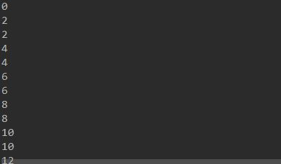
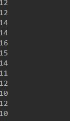

# Message Queue Simulator
## Class Design
- Message类包含了创建时间与处理所需时间的字段。仿真实际情况下每个request所需的时间。
- MessageQueue类存储消息队列，当队列长度达到阈值后转为Stack，队列中如超时，则移除此message
- Consumer：4个consumer，每秒生成一个处理时间为2秒的message
- Producer：3个producer，持有message，当message被处理后，置message为空进入闲置状态。
- TimeCounter： 计时器，每秒钟consumer与producer并行处理，模拟多线程。producer向队列中加入message，consumer如处于闲置状态，则从队列中取出消息进行处理。

## Result
基于上述规则，我记录了队列长度的变化趋势如下：   
0 
2 
2 
4 
4 
6 
6 
8 
8 
10 
10 
12 
12 
14 
14 
16 
15 
14 
11 
12 
10 
12 
10 
12 
10       



可以看出，尽管Consumer的处理能力不及Producer，导致队列长度迅速上升，但最终队列长度稳定在10-12波动。

## Compare
```
//if(this.isQueue())
    return this.mq.remove(0);
//else return this.mq.remove(this.Queuelen()-1);
Timecounter：
            //mq.clear(now);
```
添加上述注释后，结果变为：0 
2 
2 
4 
4 
6 
6 
8 
8 
10 
10 
12 
12 
14 
14 
16 
16 
18 
18 
20 
20 
很明显，由于缺乏对于过期item的处理，队列长度不断累积。

## Conclusion
消息队列的优化尽管淘汰了部分过期消息，但有效控制住了队列的长度。
