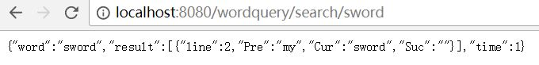
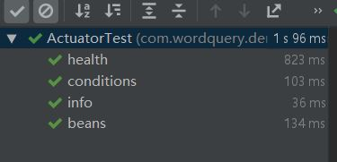

# Word Query Web Version
# 单词查询程序
=========================

程序设计与数据结构课程的第一次习题课作业。

## 写在前面：第二次迭代
* security：
复用内置的login的html，在内存中创建了root的账户，使用自定义明码decoder，并拦截所有请求，登录后即可正常访问
* actuator:
进行了接口测试并且修改了相关配置
* 第一次迭代：gitworkflow
补充了pull request
* 第一次迭代：设计
对于返回的格式进行了重构，现在可以直接返回查询结果对象，以json模式给出。  
并且重构了api为/wordquery/search/{input}
* 第一次迭代：集成测试
现在对于api接口进行了测试，对于状态和内容均有涵盖

## 主要功能
对于输入的文件进行解析，此后由用户进行单词查询。查询结果为其行号，前后文，出现总次数。

## 项目历史

原程序使用c++，移植至java版本后，作为maven项目，添加了Junit的单元测试。  
移植至Springboot，将System级的IO改成字符串接口，从而更加适应web环境。  
添加了单元测试用例，并将上文字符串api重构为对象序列化的json格式

## Preview

### 程序运行
```
mvn install
```

- run: 
```
mvn spring-boot:run
```
- test:
```
mvnw clean test
```

注：由于shakesphere.txt太大了，因此采取了Unlimited Blade Works作为demo文件。     
再注： 并没有前端，所以输出也莫得了。只能直接访问api。      
1、登录   
<div align="center">
	
</div>
2、在前端输入你想要查询的单词。    
3、输出查询结果json。       
4、go to 2.     

### 项目结构

- *Controller.java: 接口层
- *.java: 逻辑层
- *Tests.java: 测试
- Config.java: 配置

### 程序演示

以下是restful GET接口的演示，证明我们的接口正常运行
<div align="center">
	
</div>

### 程序结构

本程序的local部分由四个部分组成  
* Judger负责判断单词的性质，持有两个方法，分别判断单词是否为数字，单词是否为新文章标识符。  
* Resolver负责对于单词进行解析重组，持有两个方法，分别将单词的标点进行清洗，行拆分为单词组。  
* WordQuery负责程序主体，持有三个方法，构造函数进行文本读取，其余分别处理程序的交互部分与查询部分。
* QueryResult负责存储和序列化程序输出的容器。格式为word+ context数组+ time

### 程序测试

本程序对处理逻辑的Judger与Resolver进行了测试，结果与预期一致。
<div align="center">
	
</div>
此外，通过mockMVC，对于接口进行了集成测试。测试了状态，与部分内容与预期配置一致。

<div align="center">
	
</div>

## 依赖

JB idea 2018.3  
Junit 4  
Java 12  
Spring Boot
## 文档

函数使用方法见项目内部注释。  

## 致谢

* 感谢 我自己提供的C++源代码
