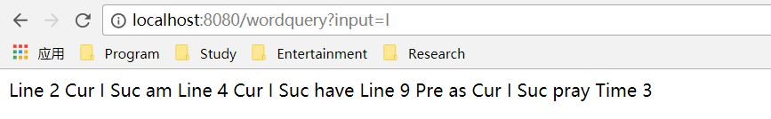
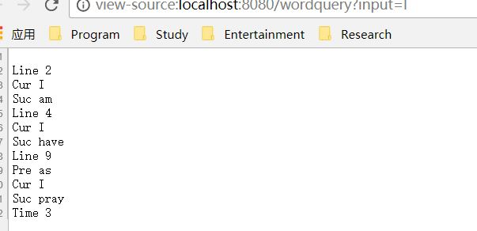
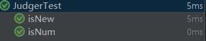

# Word Query Web Version
# 单词查询程序
=========================

程序设计与数据结构课程的第一次习题课作业。

## 主要功能
对于输入的文件进行解析，此后由用户进行单词查询。查询结果为其行号，前后文，出现总次数。

## 项目历史

原程序使用c++，移植至java版本后，作为maven项目，添加了Junit的单元测试。  
移植至Springboot，将System级的IO改成字符串接口，从而更加适应web环境。  
因为想不到哪里能用java9的新语法，而且我自己的版本停留在java9，所以泛型类型推导也算是和泛型沾边吧。（就像是c++14的auto一样的德行）  

## Preview

### 程序运行
```
mvn install
```

- run: 
```
mvn spring-boot:run
```
- test:
```
mvnw clean test
```

注：由于shakesphere太大了，因此采取了UBW作为demo文件。     
再注： 并没有前端，所以输出也莫得了。  
1、在前端输入你想要查询的单词。   
2、输出查询结果。     
3、go to 1.   

### 项目结构

- WordQueryController.java: 接口层
- WordQuery.java: 逻辑层
- *Tests.java: 单元测试


### 程序演示

以下是restful GET接口的演示，证明我们的接口正常运行
<div align="center">
	
</div>
但是格式有点不太对，应该是浏览器显示问题
<div align="center">
	
</div>

### 程序结构

本程序由三个部分组成  
* Judger负责判断单词的性质，持有两个方法，分别判断单词是否为数字，单词是否为新文章标识符。  
* Resolver负责对于单词进行解析重组，持有两个方法，分别将单词的标点进行清洗，行拆分为单词组。  
* WordQuery负责程序主体，持有三个方法，构造函数进行文本读取，其余分别处理程序的交互部分与查询部分。

### 程序测试

本程序对处理逻辑的Judger与Resolver进行了测试，结果与预期一致。单元测试未改变。
<div align="center">
	
</div>

## 依赖

JB idea 2018.3  
Junit 4  
Java 9  
Spring Boot
## 文档

函数使用方法见项目内部注释。  

## 致谢

* 感谢 我自己提供的C++源代码
