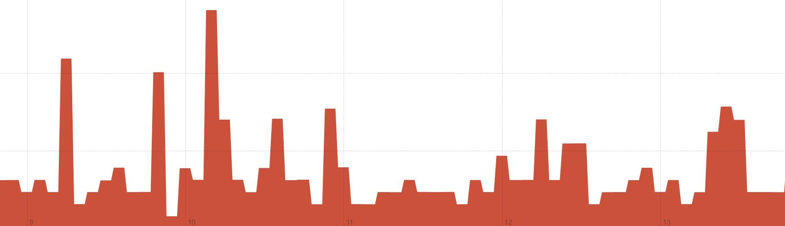
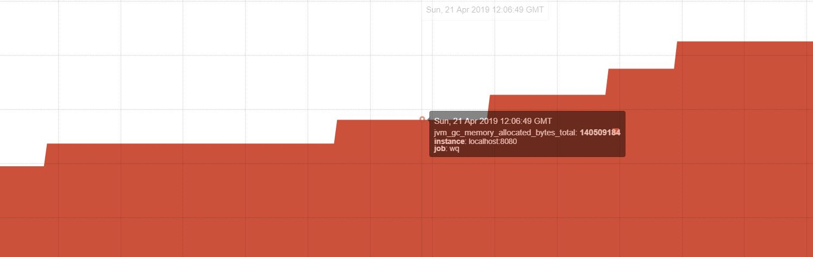

# 资源监测
本次监测使用的是普罗米修斯对actuator/prometheus端口的监测。由于我使用的文件示例过小，CPU的使用率一直处于极低的位置。   
监听的字段为jvm_gc_memory_allocated_bytes_total即虚拟机分配的堆内存，process_cpu_usage即进程使用CPU

## No requset
此时CPU使用率为0.0031227     
JVM分配的内存为97517568Byte

## With request
下图是发起并增加request的结果，访问频率可以从CPU的使用率看出。    
以下是CPU使用率的变化，可以看出，一方面，访问频率的上升会导致CPU占用率的上升，毋庸置疑。另一方面，访问结束后，CPU不会继续被占用，而是回到初始状态。

	

以下是内存使用的变化。值得注意的点在于
- 每次扩容分配的大小在逐步上升，如某次扩容大小为24117248Byte，前一次为23068672，再前一次约22000000，最开始的扩容20971520。具体原因未知，猜测是虚拟机的内存分配策略。
- 内存的占用持久性存在，推测是为了加速下次访问采取了cache机制，这使得上述的CPU变化在多次访问同一个api时其实并不明显。
- 内存的扩容采取的是类似C++的vector机制，即每次扩容较大的内存以免使得内存分配频繁。达到某个阈值后才进行下一次扩容。

	

