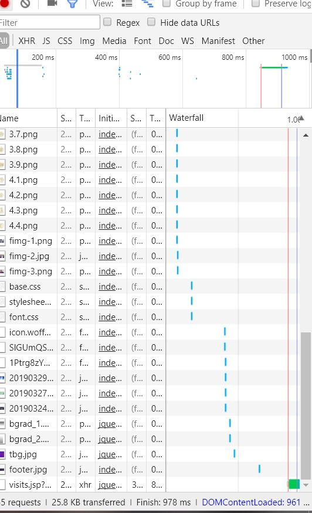
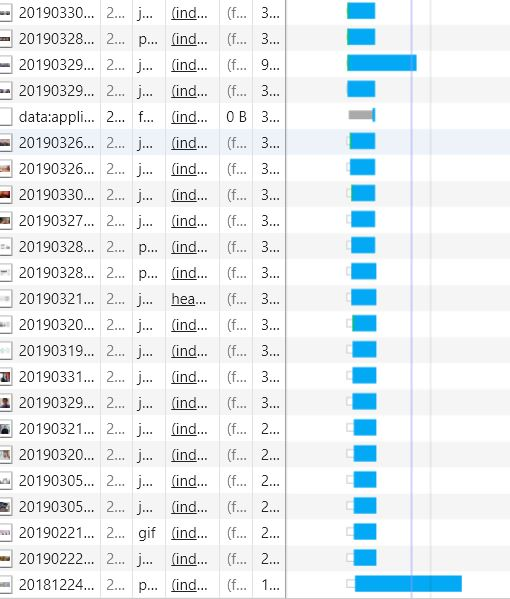

# 上海交通大学主页性能分析
=========================

软件工程课程的第一次作业，为了避免职责造成的先天不同，我选择了清华大学首页作为对照组，以减少不可控的变量

## 整体描述
交大首页的loading时间相对较少，仅190.6ms，但实际总加载时间很长，约7s，主要时间开销为渲染。  

	

而清华大学的loading时间为121.8ms，相比之下总加载时间仅为1s。

	

## 主要原因
在上述基础上，我对于网络部分进行了进一步分析，其中，  
上海交通大学发起了121个请求，193kb的数据交换，用时3.23s。
而清华大学则仅有55个请求，25.8kb的数据交换，用时仅805ms。  
网络部分的漏洞，使得浏览器的处理被不可避免的延缓，是主要原因之一。   
值得注意的是，左图中清华大学的包普遍具有接近的大小，能在极短时间内接收完成，而右图交大的包则存在部分的害群之马。

	

	

## Preview

### 程序运行

1、输入带查询的文件路径。 
2、输入你想要查询的单词。 
3、输出查询结果。   
4、go to 2. 
### 程序演示

以下为使用and作为查询单词的输出结果，仅截取最后部分。  

	

### 程序结构

本程序由三个部分组成  
Judger负责判断单词的性质，持有两个方法，分别判断单词是否为数字，单词是否为新文章标识符。  
Resolver负责对于单词进行解析重组，持有两个方法，分别将单词的标点进行清洗，行拆分为单词组。  
EP1负责程序主体，持有三个方法，除作为入口的main外，分别处理程序的解析部分与查询部分。

### 程序测试

本程序对处理逻辑的Judger与Resolver进行了测试，结果与预期一致。  

	

## 依赖

JB idea 2018.3  
Junit 4  
Java 9  

## 文档

函数使用方法见项目内部注释。  

## 致谢

* 感谢 我自己提供的C++源代码
