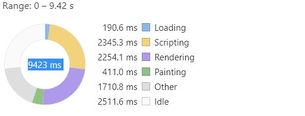
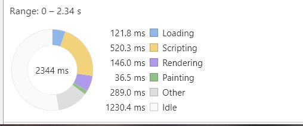
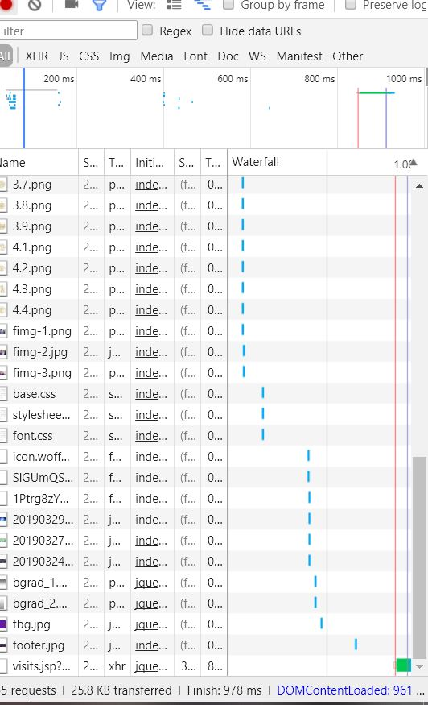
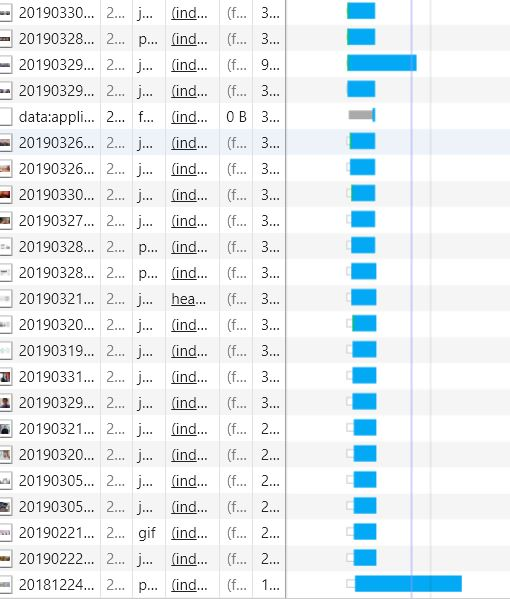
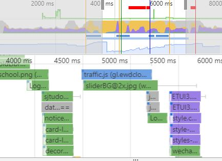

# 上海交通大学主页性能分析
=========================

软件工程课程的第一次作业，为了避免职责造成的先天不同，我选择了清华大学首页作为对照组，以减少不可控的变量

## 整体描述
交大首页的loading时间相对较少，仅190.6ms，但实际总加载时间很长，约7s，主要时间开销为渲染。  

	

而清华大学的loading时间为121.8ms，相比之下总加载时间仅为1s。

	

## 主要原因  
在上述基础上，我对于网络部分进行了进一步分析，其中，  
上海交通大学发起了121个请求，193kb的数据交换，用时3.23s。  
而清华大学则仅有55个请求，25.8kb的数据交换，用时仅805ms。   
网络部分的漏洞，使得浏览器的处理被不可避免的延缓，是主要原因之一。     
值得注意的是，左图中清华大学的包普遍具有接近的大小，能在极短时间内接收完成，而右图交大的包则存在部分的害群之马。   

	
	

这一现象导致了非常严重的后果，如在某一段时间窗口，一张图片几乎占用了所有的网络开销，从而减缓了整体的加载。

	

## 原因分析

一方面，从资源质量而言，清华在不重点的部分采用了png格式（如背景），从而减少了资源总量，而交大不仅大范围选择高清晰度的jpg，甚至在局部采用gif动图。
甚至于，上面强调的害群之马，在网页中仅仅显示为一个很小的区域。

	

这种不必要的信息传输在分辨率远远高过网页表现能力的情况下造成了严重的负担。    
另一方面，从资源数量而言，交大大面积使用图片，而图片本身承载的信息量却极少。事实上，作为旁观者，对于新闻的具体内容更为关心。这也导致了交大整体的版面长度不断增加。

	
	

## 改进想法  
1、 服务器提供不同质量的图片，如缩略图等，不能直接使用原始资源。应当事先在服务器端处理好缩放等过程，而非在前端将高分辨率的图片强行压缩。合理选择分辨率，某些小版面减少资源投入。    
2、 子门户增加独立性，微信公众号级别的专栏，几乎是整个搬到了官网。设计者大概出于自身立场所为，我不置可否。   
3、 功能冗余，页脚和快速入口存在大量功能重合。应当直接舍弃一部分。    
4、 动态效果过多，如每个可点击处均存在的悬停放大，甚至于微信和微博的图标也有。减少无必要的交互，减少脚本量。    
